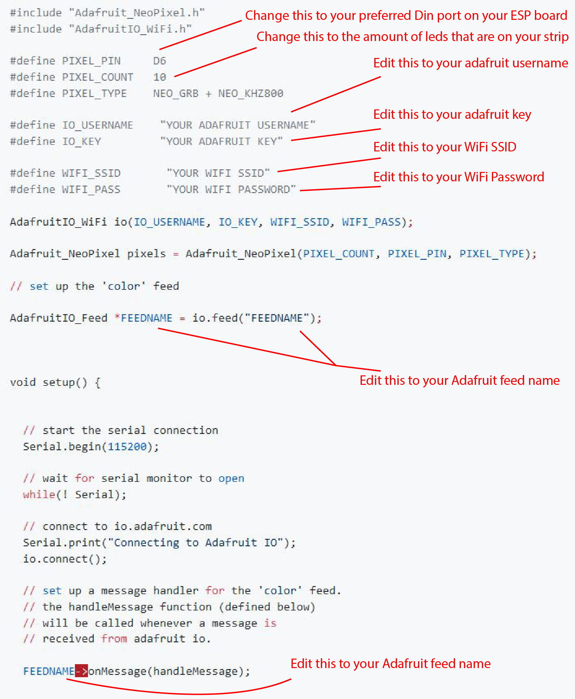

## Calender Event with ESP8266, Arduino, Adafruit and IFTTT

# 1. Introduction

This tutorial will teach you how to connect your ESP8266 to Adafruit to read out your data online. This data will then be used to automatically create a google calendar event using IFTTT. The data that we will be using is from a NeoPixel RGB LED strip that we can control online through Adafruit.

## 2. What do I need?

1. An ESP8266, this is a low-cost microchip with built in WiFi:


2. 3x female to female jumper wires


3. Micro USB cable


4. NeoPixel RGB LED Strip


## 3. Setting up

### Arduino

For the code of this project we're gonna be using Arduino. This is a free open-source code writing tool that allows us to upload code to our microchip.

You can download it for free here: https://www.arduino.cc/en/Main/Software

When you first open up arduino, you need to install a couple of things first.

1. Go to File > Preferences, at the bottom in the field "Additional Boardmanager URL's" enter this : http://arduino.esp8266.com/stable/package_esp8266com_index.json and click OK.
2. Now click "Tools" > "Board" > "Boards manager" and search "esp8266" and install "esp8266 by esp8266 Community" and restart the arduino software
3. Connect your ESP to your pc through USB and go to "Tools" > "Board" and select "NodeMCU 1.0 ESP12E Module"
4. Now go to "Tools" > "Port" and select the "...usbserial14...". If a COM port is available, that will work aswell.
5. Next go to "Sketch" > "Include library" > "Manage libraries" and search and install the following libraries: "Adafruit MQTT library", "Adafruit NeoPixel", "Adafruit IO Arduino".
6. Restart your Arduino software.

### Adafruit

https://io.adafruit.com/
create an account, save your settings go back to https://io.adafruit.com
greeted by dashboard lets go ahead and create your first dashboard.
click on "actions" and then "create new Dashboard
Give it a name of your liking and optionally write a short description
Now on the left hand of the page click on Feeds.
Create a new feed the same way you created your dashboard.
Now go back to dashboards and click on your newly created dashboard
Click on the blue + icon on the top right of the page
Now select the color picker
It will ask you to connect a feed to your color picker, select the feed you just made and press next
After that click on Create Block
When you click on the color picker circle you can now select a color, it won't do anything yet though.
On the top right you can see a little key icon, press that and copy your key somewhere, we will need it later.
We're done for now on Adafruit, make sure to keep a tab open on the dashboard, we will need it soon.

## 4. The Code

Now we can start coding. Open a new Arduino file and copy the whole code below in your file.

<details><summary>The Code (click me)</summary>
  
  
<p>

## Copy the whole code in your new Arduino File

```python
// Adafruit IO RGB LED Output Example
//
// Adafruit invests time and resources providing this open source code.
// Please support Adafruit and open source hardware by purchasing
// products from Adafruit!
//
// Written by Todd Treece for Adafruit Industries
// Copyright (c) 2016-2017 Adafruit Industries
// Licensed under the MIT license.
//
// All text above must be included in any redistribution.

/************************** Configuration ***********************************/

// edit the config.h tab and enter your Adafruit IO credentials
// and any additional configuration needed for WiFi, cellular,
// or ethernet clients.
#include "config.h"

/************************ Example Starts Here *******************************/

#include "Adafruit_NeoPixel.h"
#include "AdafruitIO_WiFi.h"

#define PIXEL_PIN     D6
#define PIXEL_COUNT   10
#define PIXEL_TYPE    NEO_GRB + NEO_KHZ800

#define IO_USERNAME    "YOUR ADAFRUIT USERNAME"
#define IO_KEY         "YOUR ADAFRUIT KEY"

#define WIFI_SSID       "YOUR WIFI SSID"
#define WIFI_PASS       "YOUR WIFI PASSWORD"

AdafruitIO_WiFi io(IO_USERNAME, IO_KEY, WIFI_SSID, WIFI_PASS);

Adafruit_NeoPixel pixels = Adafruit_NeoPixel(PIXEL_COUNT, PIXEL_PIN, PIXEL_TYPE);

// set up the 'color' feed

AdafruitIO_Feed *FEEDNAME = io.feed("FEEDNAME");


void setup() {


  // start the serial connection
  Serial.begin(115200);

  // wait for serial monitor to open
  while(! Serial);

  // connect to io.adafruit.com
  Serial.print("Connecting to Adafruit IO");
  io.connect();

  // set up a message handler for the 'color' feed.
  // the handleMessage function (defined below)
  // will be called whenever a message is
  // received from adafruit io.

  FEEDNAME->onMessage(handleMessage);


  // wait for a connection
  while(io.status() < AIO_CONNECTED) {
    Serial.print(".");
    delay(500);
  }

  // we are connected
  Serial.println();
  Serial.println(io.statusText());

  // neopixel init
  pixels.begin();
  pixels.show();
}


void loop() {

  // io.run(); is required for all sketches.
  // it should always be present at the top of your loop
  // function. it keeps the client connected to
  // io.adafruit.com, and processes any incoming data.
  io.run();

}


// this function is called whenever a 'color' message
// is received from Adafruit IO. it was attached to
// the color feed in the setup() function above.
void handleMessage(AdafruitIO_Data *data) {

  // print RGB values and hex value
  Serial.println("Received HEX: ");
  Serial.println(data->value());
  
  long color = data->toNeoPixel();

  for(int i=0; i<PIXEL_COUNT; ++i) {
    pixels.setPixelColor(i, color);
  }

 Serial.println(pixels.getPixelColor(0));

   pixels.show();

}
```

</p>
</details>


There are a couple of things we need to change in our code to make it work. Change everything noted in this picture:


After you have changed these things you can upload the code by pressing the "Upload button". This will now upload the code to the ESP8266 you have connected through USB.

After the uploading is done you can open your serial monitor (make sure you set the baud rate to 115200) and you can see that the ESP has connected to Adafruit.


## 5. Hardware

Now it's time to connect the NeoPixel to our ESP board.

First you have to cut the Strip to the right length and solder or hot glue three jumper wires to each of the three connectors: "Ground", "Din" and "+5V".

Next, you can connect the female ends of the jumper cables to the ESP board. Connect Ground to "GND", Din to "D6" (OR ANY OTHER DIN CONNECTOR, MAKE SURE YOU CHANGE D6 TO YOUR PREFERRED CONNECTION IF YOU CHANGE IT) and "+5V" to "3V"
